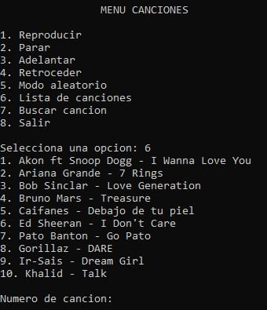

# Music Player in C

A console-based music player developed in **C** that demonstrates the implementation of a **circular doubly linked list**, user authentication with file persistence, and WAV audio playback using the Windows multimedia library.

The project was developed to practice dynamic memory management, linked data structures, file handling, and modular programming.

> **Note:** Audio files are not included in this repository due to copyright restrictions.

---

# Features

- User registration and login system.
- User data persistence using a text file.
- Circular doubly linked list for playlist management.
- Add and organize songs in a playlist.
- Play songs.
- Stop playback.
- Next song navigation.
- Previous song navigation.
- Random song mode.
- Search songs by name.
- Playlist visualization.
- Console-based interface.

---

# Technologies Used

- C Programming Language
- Dynamic Memory Allocation (`malloc`)
- Circular Doubly Linked Lists
- File Handling
- Windows Multimedia API (`sndPlaySound`)
- Standard C Libraries

---

# Data Structures

The main structure used in this project is a **Circular Doubly Linked List**.

Each song node contains:

- Song path.
- Song name.
- Pointer to the previous song.
- Pointer to the next song.

The circular structure allows continuous navigation:

```
Song 1 <-> Song 2 <-> Song 3
  ^                       |
  |_______________________|
```

The playlist stores:

- First song pointer.
- Number of songs.

---

# Project Structure

```
Music-Player/
│
├── src/
│   └── music_player.c
│
├── assets/
│   └── images/
│       ├── login_screen.jpg
│       ├── music_menu.jpg
│       ├── playing_song.jpg
│       └── playlist.jpg
│
├── usuarios.txt
├── README.md
├── LICENSE
└── .gitignore
```

---

# Screenshots

## Login Screen

The application starts with a user authentication system.


---

## Main Menu

The main menu provides access to the different playback options.


---

## Playlist

The playlist displays the songs stored in the circular doubly linked list.




---

## Playing Song

Shows the current song being reproduced.


---

# User Accounts

The project uses a file named `usuarios.txt` to store registered users.

Example test accounts:

| Username | Password |
|----------|----------|
| admin | admin123 |
| usuario | usuario123 |
| invitado | invitado123 |
| demo | demo123 |

New users can also be registered directly from the application.

---

# Audio Files

The application uses `.wav` files through the Windows multimedia library.

The original songs are not included in this repository due to copyright restrictions.

To use the player:

1. Create a folder named:

```
musica
```

2. Add your own `.wav` files.

3. Name the files:

```
1.wav
2.wav
3.wav
4.wav
5.wav
6.wav
7.wav
8.wav
9.wav
10.wav
```

The program will automatically load these files.

---

# Compilation

This project requires a Windows environment because it uses:

```c
#include <windows.h>
#include <mmsystem.h>
```

Compile using GCC:

```bash
gcc music_player.c -o MusicPlayer -lwinmm
```

---

# Execution

After compiling:

```bash
MusicPlayer.exe
```

---

# Learning Objectives

This project demonstrates:

- Circular doubly linked list implementation.
- Dynamic memory allocation.
- Pointer management.
- File reading and writing.
- User authentication.
- Modular programming.
- Console application development.
- Audio playback in C.

---

# Limitations

- Windows only.
- Supports WAV files only.
- No graphical user interface.
- Audio files must be provided by the user.
- Uses local file storage for users.

---

# Future Improvements

Possible improvements:

- Graphical interface.
- MP3 support.
- Automatic music folder scanning.
- Playlist saving.
- Volume control.
- Song duration display.
- Repeat mode.
- Better user management.

---

# License

This project is distributed under the MIT License.

See the `LICENSE` file for more information.
