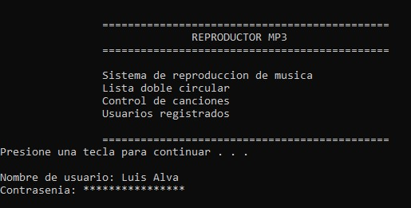
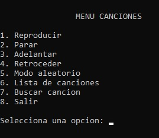
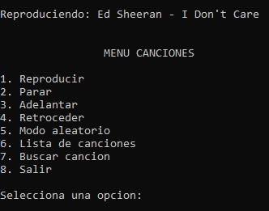

# Console Music Player

A console-based music player developed in C/C++ that manages songs using circular doubly linked lists and provides basic user authentication through file handling.

## Overview

This project implements a music player in a terminal environment.

Songs are stored and managed using a circular doubly linked list structure, allowing navigation between tracks using previous and next pointers.

The application also includes a basic user registration system, song search functionality and random playback.

## Features

- User registration and login system.
- Song management using circular doubly linked lists.
- Play and stop audio.
- Next and previous song navigation.
- Random song mode.
- Search songs by name.
- Console-based interface.
- File handling for user storage.

## Screenshots

### Login Screen



### Music Menu



### Playing Song



## Technologies

- C/C++
- Dev-C++
- Windows Multimedia API
- Dynamic Memory Allocation
- File Handling

## Data Structures Used

### Circular Doubly Linked List

Each song node contains:

- Song path.
- Song name.
- Previous node pointer.
- Next node pointer.

This allows movement forward and backward through the playlist.

## Project Structure

```text
.
├── assets
│   └── images
│       ├── login_screen.jpg
│       ├── music_menu.jpg
│       └── playing_song.jpg
├── console_music_player.cpp
├── usuarios_example.txt
├── README.md
├── LICENSE
└── .gitignore
```

## Compilation

Using GCC:

```bash
g++ console_music_player.cpp -o console_music_player
```

## Execution

Windows:

```bash
console_music_player.exe
```

## Concepts Demonstrated

- Structures
- Pointers
- Dynamic memory allocation
- Circular doubly linked lists
- File handling
- Searching algorithms
- Randomization
- Console interface design

## Limitations

- Designed for Windows systems.
- Requires local audio files.
- User authentication is a basic implementation.
- Audio paths must be configured manually.

## License

MIT License

## Author

Luis Alva
